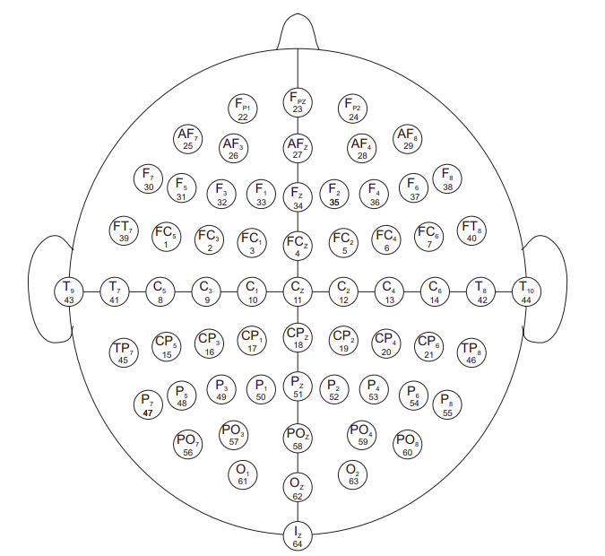

# Physionet Dataset
[EEG Motor Movement/Imagery Dataset](https://physionet.org/content/eegmmidb/1.0.0)

## Abstract
This data set consists of over 1500 one and two-minute EEG recordings, obtained from 109 volunteers, as described below.

## Experimental Protocol
Subjects performed different motor/imagery tasks while 64-channel EEG were recorded using the [BCI2000 system](http://www.bci2000.org). Each subject performed 14 experimental runs: two one-minute baseline runs (one with eyes open, one with eyes closed), and three two-minute runs of each of the four following tasks:

1. A target appears on either the left or the right side of the screen. The subject opens and closes the corresponding fist until the target disappears. Then the subject relaxes.
2. A target appears on either the left or the right side of the screen. The subject imagines opening and closing the corresponding fist until the target disappears. Then the subject relaxes.
3. A target appears on either the top or the bottom of the screen. The subject opens and closes either both fists (if the target is on top) or both feet (if the target is on the bottom) until the target disappears. Then the subject relaxes.
4. A target appears on either the top or the bottom of the screen. The subject imagines opening and closing either both fists (if the target is on top) or both feet (if the target is on the bottom) until the target disappears. Then the subject relaxes.

In summary, the experimental runs were:

1. Baseline, eyes open
2. Baseline, eyes closed
3. Task 1 (open and close left or right fist)
4. Task 2 (imagine opening and closing left or right fist)
5. Task 3 (open and close both fists or both feet)
6. Task 4 (imagine opening and closing both fists or both feet)
7. Task 1
8. Task 2
9. Task 3
10. Task 4
11. Task 1
12. Task 2
13. Task 3
14. Task 4

The data are provided here in EDF+ format (containing 64 EEG signals, each sampled at 160 samples per second, and an annotation channel). For use with PhysioToolkit software, [rdedfann](https://physionet.org/physiotools/wag/rdedfa-1.htm) generated a separate PhysioBank-compatible annotation file (with the suffix .event) for each recording. The .event files and the annotation channels in the corresponding .edf files contain identical data.

Each annotation includes one of three codes (T0, T1, or T2):
    
- T0 corresponds to rest
- T1 corresponds to onset of motion (real or imagined) of
    - the left fist (in runs 3, 4, 7, 8, 11, and 12)
    - both fists (in runs 5, 6, 9, 10, 13, and 14)
- T2 corresponds to onset of motion (real or imagined) of
    - the right fist (in runs 3, 4, 7, 8, 11, and 12)
    - both feet (in runs 5, 6, 9, 10, 13, and 14)

In the BCI2000-format versions of these files, which may be available from the contributors of this data set, these annotations are encoded as values of 0, 1, or 2 in the TargetCode state variable.

## Montage
The EEGs were recorded from 64 electrodes as per the international 10-10 system (excluding electrodes Nz, F9, F10, FT9, FT10, A1, A2, TP9, TP10, P9, and P10), as shown in the figure below. The numbers below each electrode name indicate the order in which they appear in the records; note that signals in the records are numbered from 0 to 63, while the numbers in the figure range from 1 to 64.

## PreProcessing
Initially, the runs corresponding to eyes closed and motor imagery tasks will be selected:

- Eyes closed
    - Run 2
- Imagine opening and closing left or right fist
    - Runs 4, 8 and 12
- Imagine opening and closing both fists or both feet
    - Runs 6, 10 and 14
    
Each EEG record in the edf-files corresponding to the runs above will be mapped to one of the following events in the target files:

    "0": "REST"
    "1": "LEFT_FIST"
    "2": "RIGHT_FIST"
    "3": "BOTH_FISTS"
    "4": "BOTH_FEET"
    
    _\* Where REST corresponds to the eyes closed runs_

The normalization will be performed with the Z-score for each run file.

The segmentation will be performed in intervals of 10 samples.